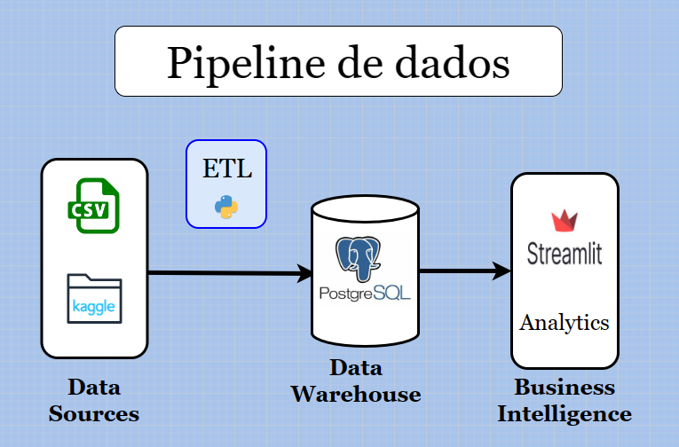

<h1> Como encontrar Hostels pelo Mundo 🌍</h1>

 Como descobrir os hostels de uma localidade e planejar sua viagem.

<h3> Sumário </h3>
<ul>
    <li> <a href='info'> Informações Gerais </a>
        <ul>
            <li> <a href='#contexto'> Contexto </a> </li>
            <li> <a href='#problema'> Problemática </a> </li>
            <li> <a href='#objetivo'> Objetivo </a> </li>
        </ul>
    </li>
    <li> 
        <a href='desenvolvimento'> Desenvolvimento </a>
        <ul>
            <li> <a href='#pipeline'> Data Pipeline  </a> </li>
        </ul>
    </li>
</ul>

 

<h2 id='info'> Informações Gerais  </h2>

    Aqui estão as informações básicas para compreender melhor o escopo deste projeto, bem como sua finalidade.

<h3 id='contexto'> Contexto </h3>

 
    Muitos não sabem mas além de Analista de Dados eu também sou Nômade Digital, mas o que isso significa ? Que estou sempre viajando para novos lugares enquanto continuo trabalhando remotamente. 

    Existem algumas abordagens sobre hospedagem para quem busca este estilo de vida nômade, uma delas a qual eu utilizo é a de se hospedar em Hostels. 

    Hostels são albergues de baixo custo no qual você convive com mais pessoas no mesmo ambiente, eles são muito buscados por jovens viajantes de todos os lugares do mundo. Portanto é comum encontrar pessoas de outros países em Hostels.  

<h3 id = 'problema'> Problemática </h3>

    Uma dificuldade comum de quem possui este estilo de vida consiste na dificuldade de pesquisar pelos Hostels que pretende se hospedar.

    Algumas das formas mais comuns de procurar por Hostels são:

<ul>
    <li> 
    <a href=''> HostelWorld </a>: Na minha opinião é o site mais utilizado para pesquisar por hostels. 
    </li>
    <li> 
    <a href=''> Instagram </a>: Mesmo não sendo a mais usada ainda é muito útil para pesquisar por hostels.
    </li>
    <li>
    <a href=''> Google e Maps </a>: É comum abrirmos o Maps e pequisar por Hostel na cidade que desejos se hospedar.
    </li>
</ul>

    Mesmo o HostelWorld sendo a mais utilizada ainda é dificil e maçante descobrir quais os hostels existem em determinado local.

    Por exemplo, estou planejando minhas viagens para o Peru, e é dificil descobrir quais cidades possuêm hostels, principalmente no HostelWorld pois precisa por cidade. Mas meu objetivo é descobrir quais cidades do Peru que possuem hostels...

<h3 id = 'objetivo'> Objetivo </h3>

    <b> Facilitar a vida de quem procura por Hostels, no caso a minha própria 😅.</b>

    Criando uma forma simples de pesquisar por hostels, ao colocar um país/cidade obter todos os hostels que existem naquela localização.

 

<h2 id='info'> Desenvolvimento  </h2>

    Nesta seção entrará o conteúdo mais técnico explicando como será resolvido o problema e criado a solução. Portanto aqui entrará temas mais técnicos sobre a área de dados. 

<h3 id='pipeline'> Data Pipeline  </h3>

    Segue abaixo a arquitetura do pipeline de dados referente a este projeto.

    Os dados foram obtidos do Kaggle e as tratativas foram realizados através de uma ETL em Python para alimentar o Data Warehouse que consiste em um PostgreSQL instânciado em um RDS na AWS. 

    Sobre a utilização dos dados será confecionado um dashboard interativo no Streamlit com deploy em Cloud.

